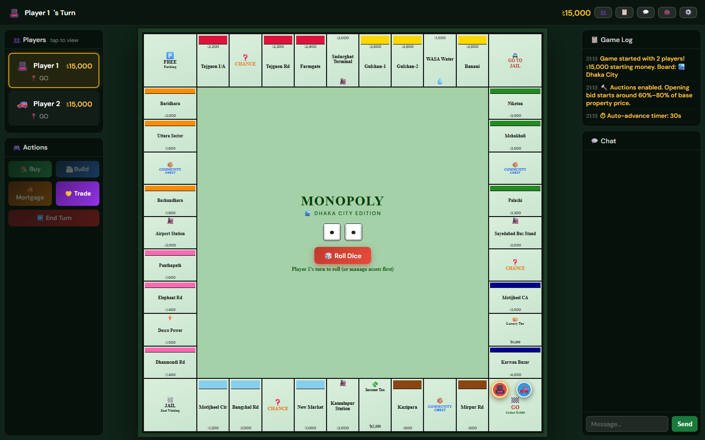
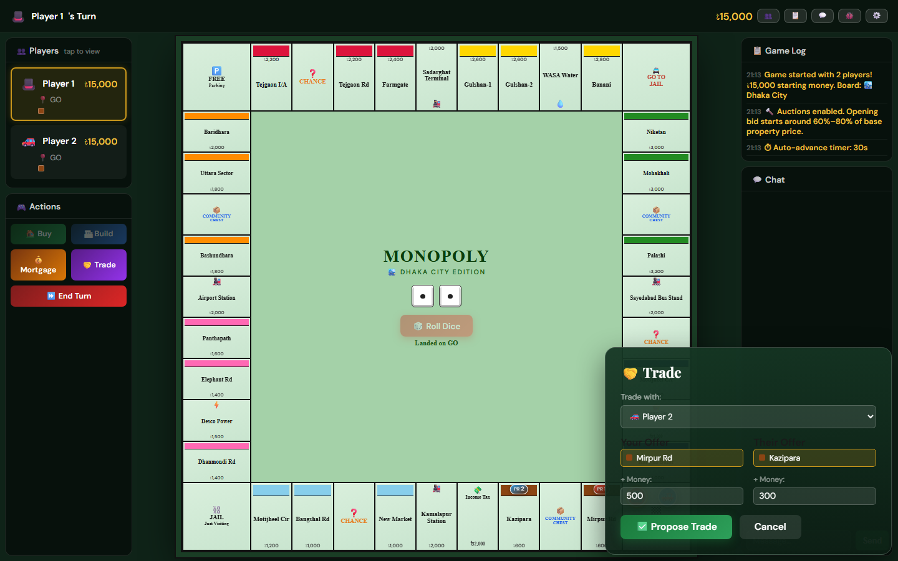
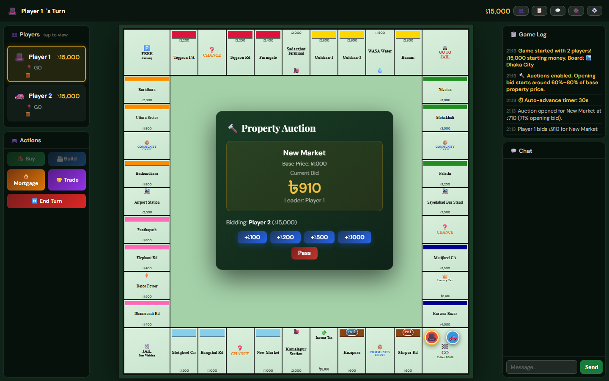
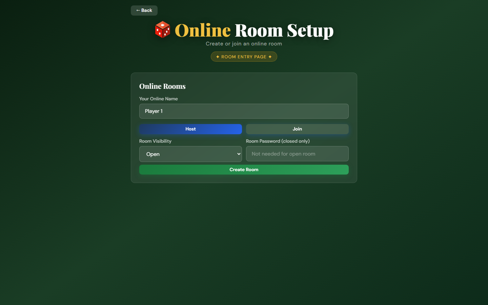
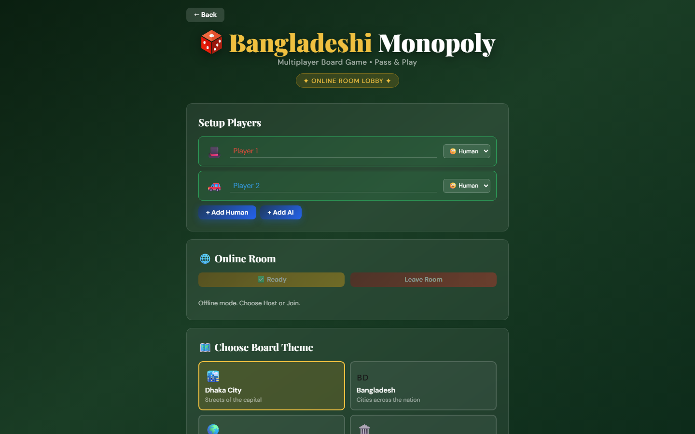
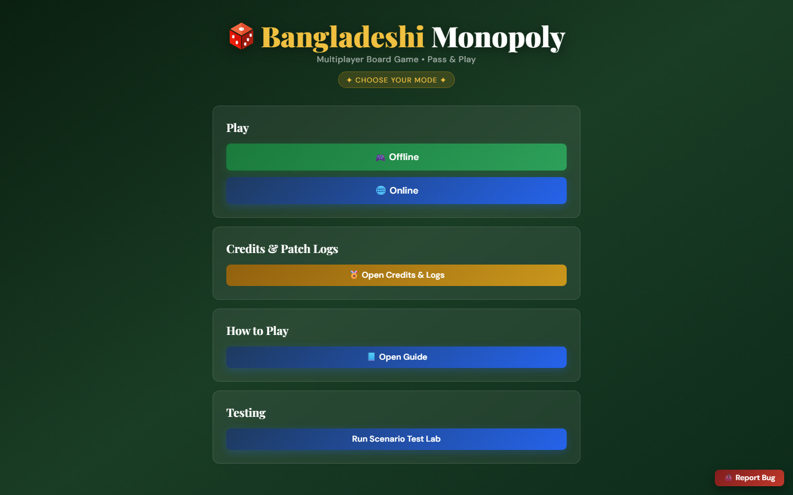
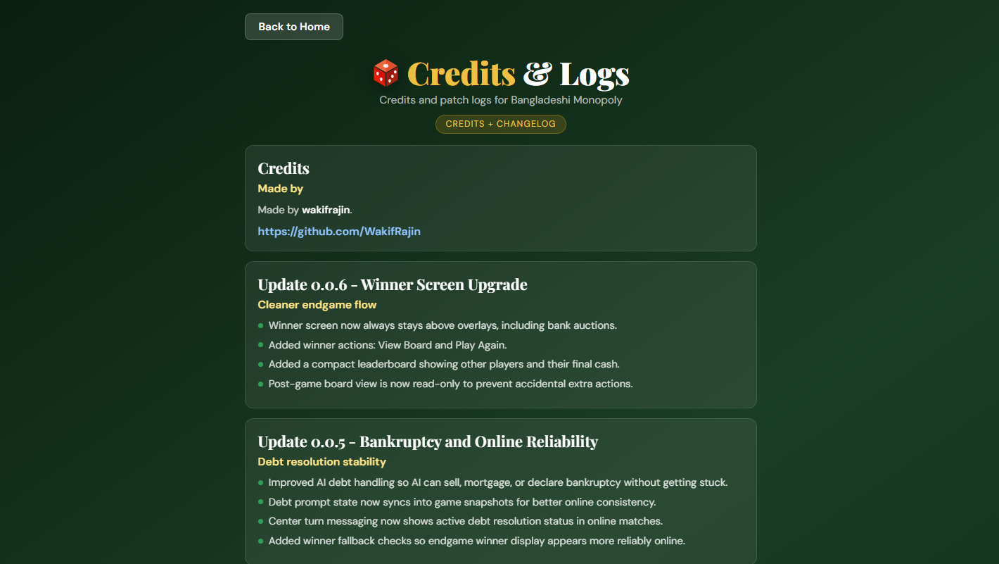
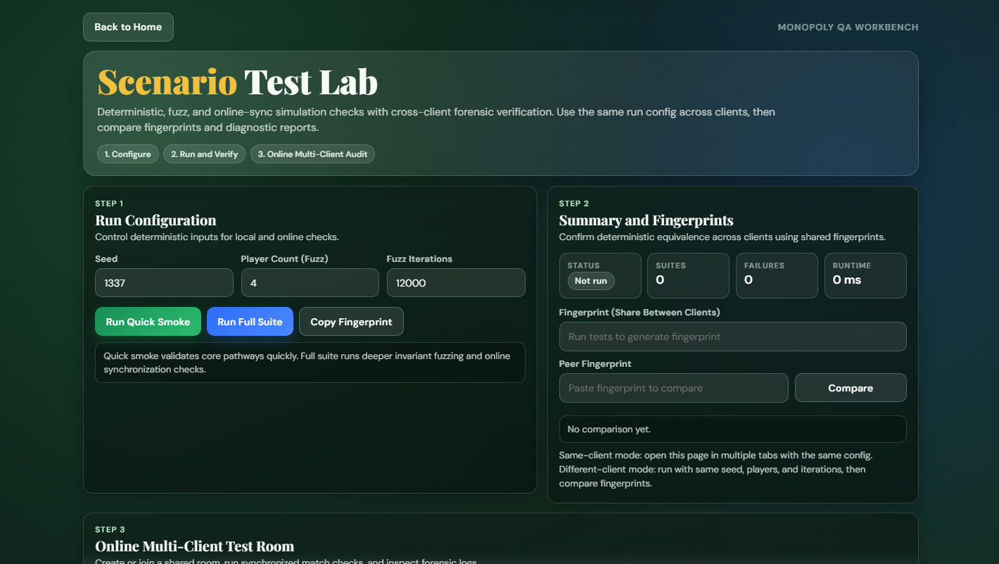

# Bangladeshi Monopoly

A browser-based Monopoly experience with a Bangladeshi flavor, local and online multiplayer, AI support, and a mobile-friendly interface.

Play now:
https://wakifrajin.github.io/monopoly-bd/

Patch notes and credits page:
https://wakifrajin.github.io/monopoly-bd/whats-new.html

## Current Snapshot

- Single-page app with the core game logic in index.html
- Local pass-and-play supports 2 to 8 players (human and AI mix)
- Online mode supports real-time room play with host controls and ready checks
- Multiple board themes with theme-specific names, currency, and GO salary

## Screenshots

### Gameplay Board



### Trading System



### Auction System



### Online Room Setup



### Online Lobby



### Home Screen



### Credits and Patch Logs



### Scenario Test Lab



## Features

### Core Gameplay

- Property buying, rent, mortgages, houses and hotels, and bankruptcy handling
- Chance and Community Chest card decks
- Jail flow with bail, doubles roll, and jail-free card support
- Player-to-player trade proposals with validation at response time
- Optional property auctions when players decline purchases
- Optional auto-advance turn timer

### Multiplayer

- Local multiplayer on one device
- Online room hosting and joining via room code
- Open rooms and password-protected closed rooms
- Ready/unready flow before match launch (host launches)
- In-game chat for online matches
- Online leave handling with AI takeover or liquidation-and-auction paths

### Themes

- Dhaka City
- Bangladesh
- World Tour
- Ancient Wonders

### UX

- Responsive desktop and mobile layouts
- Animated movement, dice visuals, and contextual toasts
- Winner screen with post-game options
- Persistent game log panel

## Important Notes

- The lobby currently shows a Max Houses/Property selector, but gameplay logic follows the classic cap of 4 houses, then hotel.
- Online mode depends on Firebase services being reachable.

## Run Locally

1. Clone or download this repository.
2. Open index.html directly in a browser, or serve the folder with any static server.
3. If using a server, open its local URL in your browser.

Example static server commands:

- python -m http.server 8080
- npx serve .

## Online Mode Setup (For Forks)

If you deploy your own copy and want online rooms:

1. Create a Firebase project.
2. Enable Anonymous Sign-in in Firebase Authentication.
3. Enable Firebase Realtime Database.
4. Replace the firebaseConfig values in index.html with your project values.
5. Deploy the static files.

## Troubleshooting

### Online service not ready

- Symptom: room actions stay disabled or show online initialization errors.
- Checks:
	- Verify Firebase config in index.html is correct for your project.
	- Ensure Anonymous Sign-in is enabled in Firebase Authentication.
	- Confirm Realtime Database is created in the same Firebase project.

### Permission denied errors

- Symptom: join/create/sync fails with permission denied.
- Cause: RTDB rules are blocking reads/writes.
- Minimal authenticated-room rule example:

```json
{
	"rules": {
		"rooms": {
			".read": "auth != null",
			".write": "auth != null"
		}
	}
}
```

### Room sync delays or stale state

- Symptom: one client seems behind.
- Checks:
	- Confirm all players have stable network connectivity.
	- Refresh the page and rejoin the room.
	- Avoid running very old and very new builds in the same room.

### Local file mode issues

- Symptom: odd browser behavior when opening index.html directly.
- Fix: run a static server (for example, python -m http.server 8080) and open via http://localhost.

## Deployment Notes

### Static hosting

- This project is static and can be deployed on GitHub Pages, Firebase Hosting, Netlify, Vercel static output, or any CDN/file host.
- Keep these files in the deployed root:
	- index.html
	- whats-new.html
	- test-lab.html
	- logo.svg

### Firebase requirements for online play

- Realtime Database must be enabled and reachable from your deployed domain.
- Anonymous Authentication must be enabled.
- RTDB rules must allow authenticated room read/write flows.

### Post-deploy checklist

1. Open the app and verify Offline mode starts successfully.
2. Create an online room and join from another browser/device.
3. Validate sync for rolls, movement, and chat.
4. Confirm closed-room password flow works.

## Project Structure

- index.html: Main game UI, rules, and logic
- whats-new.html: Patch logs and credits page
- test-lab.html: Scenario test utility page
- docs/screenshots: Screenshot assets used in README
- scripts/capture-readme-screenshots.cjs: Automated screenshot capture helper
- logo.svg: App icon/logo
- LICENSE: Apache License 2.0

## Tech Stack

- HTML5
- CSS3
- Vanilla JavaScript (ES6+)
- Firebase Realtime Database
- Firebase Authentication (anonymous sessions)

## License

Apache License 2.0
