# Bangladeshi Monopoly

A Monopoly-style board game that runs in the browser, set in Dhaka and around Bangladesh. Play on one device with friends, against the computer, or online with a room code. It works on phones and desktops, and can be installed as an app.

**[Play it](https://wakifrajin.github.io/monopoly-bd/)** · [Patch notes](https://wakifrajin.github.io/monopoly-bd/whats-new.html) · [Board editor](https://wakifrajin.github.io/monopoly-bd/boardeditor.html)

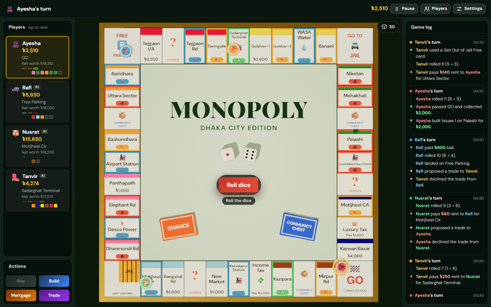

<table>
  <tr>
    <td width="33%">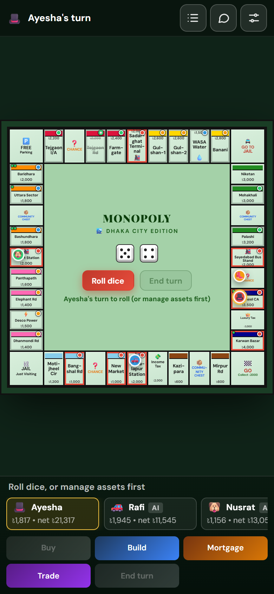</td>
    <td width="33%">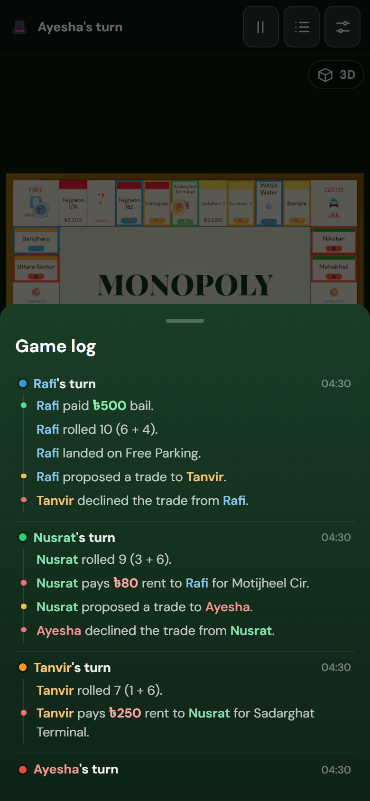</td>
    <td width="33%">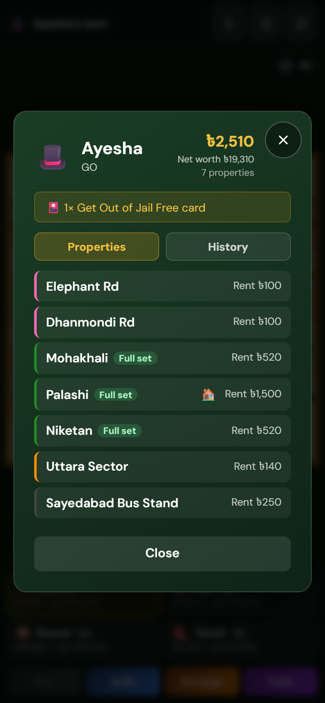</td>
  </tr>
  <tr>
    <td align="center">Board</td>
    <td align="center">Game log</td>
    <td align="center">Portfolio</td>
  </tr>
</table>

## What's in it

- **The full game.** Buying, rent, auctions, houses and hotels (built evenly, with the bank's 32 houses and 12 hotels), mortgages, jail, Chance and Community Chest, and bankruptcy that hands assets to whoever you owe. Trade properties, cash and Get Out of Jail Free cards at any time, on anyone's turn.
- **2 to 8 players.** Any mix of people and AI on one device. The AI comes in three levels (easy, normal, hard) and buys, bids, builds, trades and handles its own debts; its pace is adjustable.
- **House rules.** Free Parking jackpot, no rent while in jail, double salary for landing on GO, and a time limit where the richest player wins. A turn timer that rolls, passes or ends the turn for a player who waits too long.
- **Saved games.** Games on one device save as you play and continue from the home screen after a refresh or a closed tab; the last three are kept. They can be paused (P), which stops the AI, the timer and the match clock.
- **English and বাংলা.** The whole interface, the game log included, in either language, with Bangla digits. Players in one online match can each use their own language.
- **Online rooms.** Host an open or password-protected room and share the code or an invite link. The host starts the match once everyone is ready, and there's in-game chat (with mute). If someone drops out, the AI holds their seat until they rejoin.
- **Same Wi-Fi.** Play with people on your network without a server of your own, like PairDrop. Games hosted on the same network appear automatically; the match runs on the host's device and goes to the others directly over WebRTC. The internet is only needed for the few seconds it takes to find each other and connect.
- **Seven boards, plus your own.** Dhaka City, Bangladesh, ধনী হবার মজার খেলা, Classic, World Tour, Ancient Wonders and BUET (the BUET campus board, with its own CGPA and BIIS cards). Each has its own place names, currency and money scale.
- **Custom boards.** The [board editor](https://wakifrajin.github.io/monopoly-bd/boardeditor.html) lets you rename spaces and change prices and rents. It exports a seed code that anyone can load.
- **2D and 3D views of one table.** The board is a WebGL scene built with three.js: dice that tumble and land on the rolled numbers before anyone moves, chip tokens that hop square by square, and house and hotel models, all lit and casting shadows. The flat view is the same table seen from above; the 3D view tilts it, and switching animates the camera between the two. In 3D, drag to turn the table and scroll or pinch to zoom. Browsers without WebGL get a plain HTML board.
- **Match options.** Auctions on or off, animation and AI speed, sound and music, and first-game tips.
- **Accessible.** Keyboard shortcuts, a board you can walk with the arrow keys, dialogs that take and return focus, game events read out to screen readers, owners shown by token as well as colour, pinch-zoom, and a reduce-motion setting that also follows the device's.
- **End of the match.** A net-worth chart for the whole game, awards, and a result you can share. Wins are counted on the device.

<details>
<summary>More screenshots</summary>

| | |
|---|---|
| 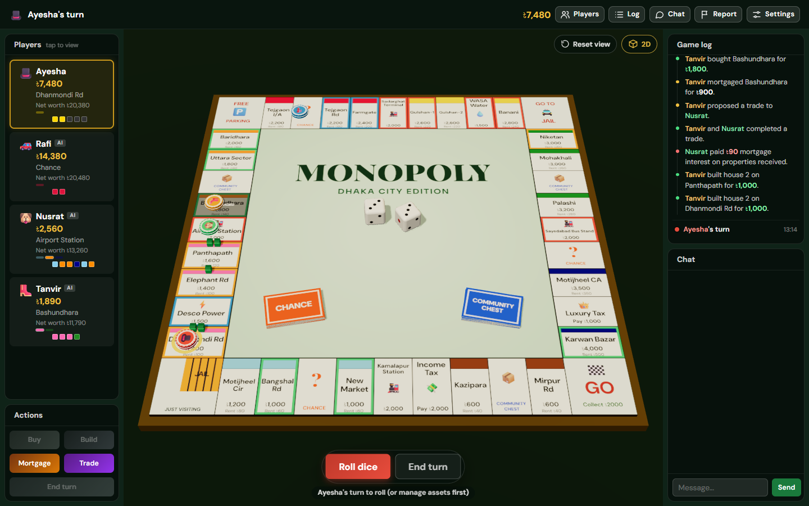 | 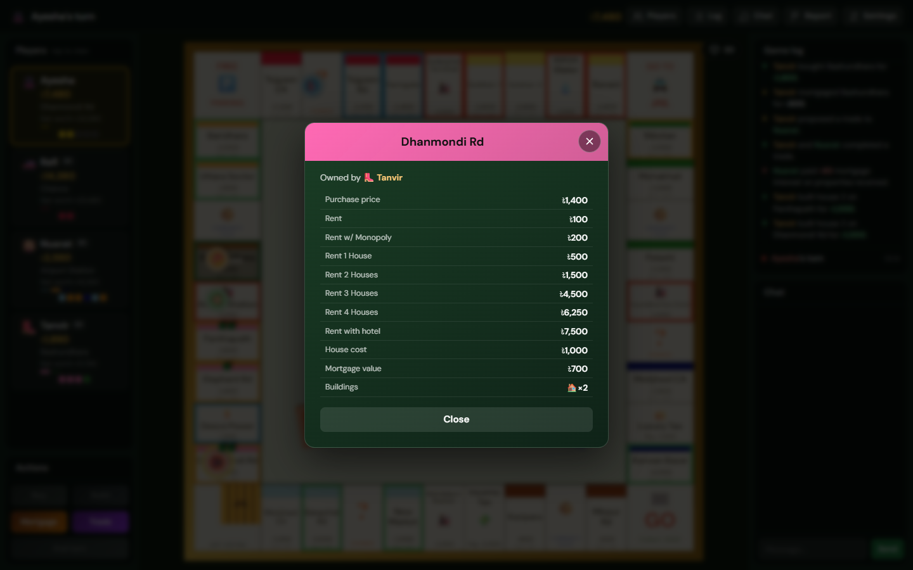 |
| 3D board | Property details |
| 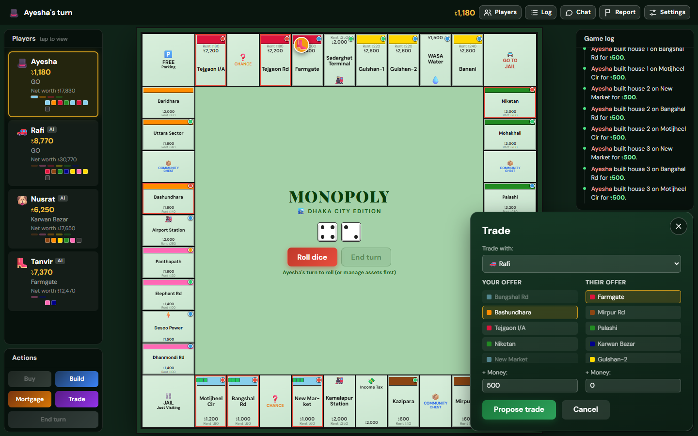 | 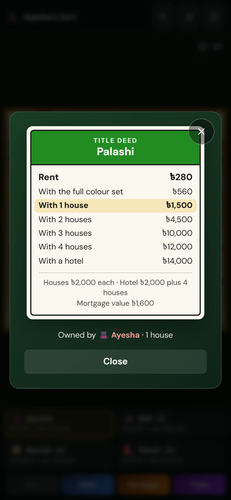 |
| Proposing a trade | Property details on a phone |
| 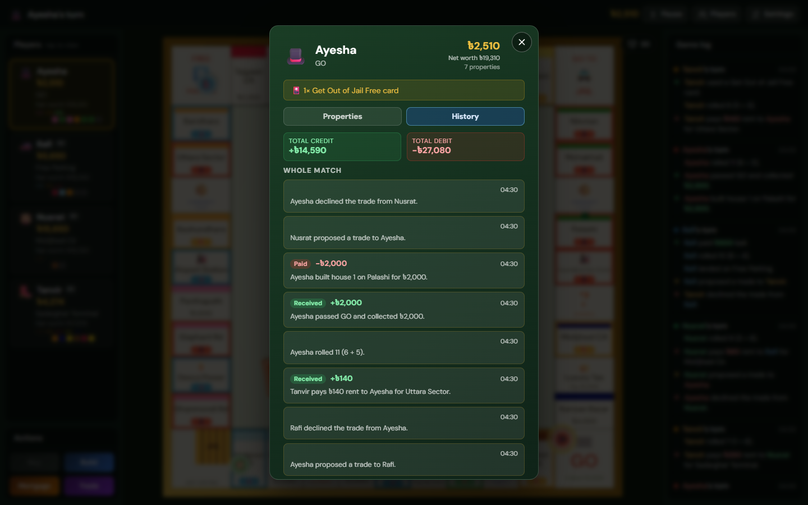 | 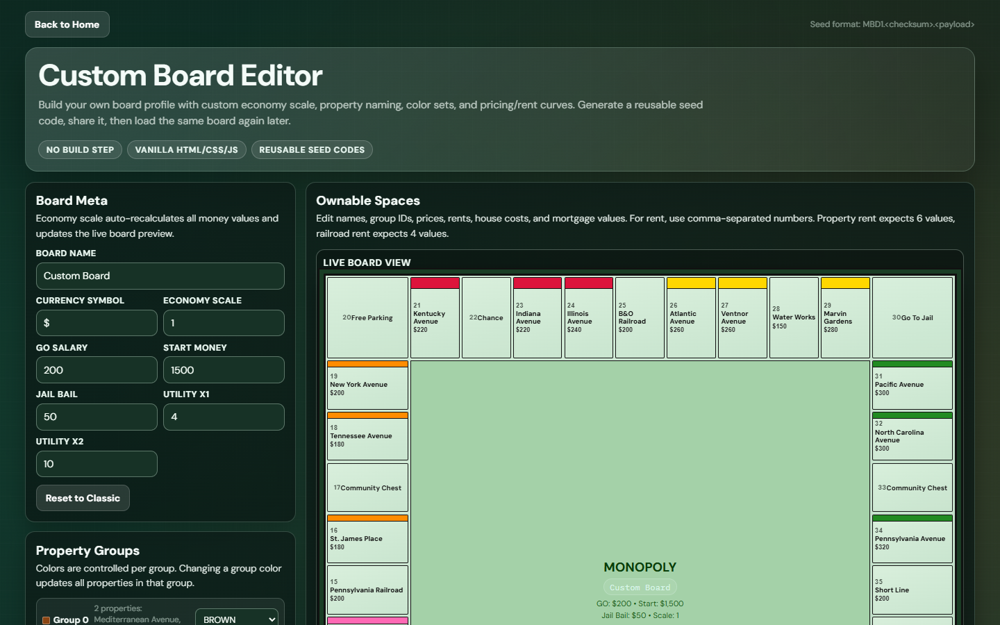 |
| A player's history for the match | Board editor |
| 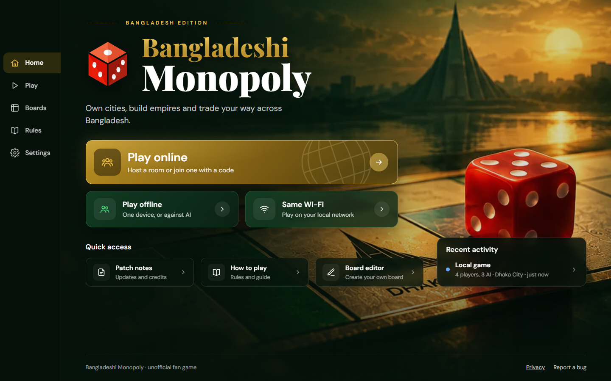 | |
| Home screen | |

</details>

## Install as an app

The game is a Progressive Web App. It has a manifest and a service worker, so browsers offer to install it, and it opens in its own window.

- **Android (Chrome):** menu → *Add to Home screen* or *Install app*.
- **iPhone and iPad (Safari):** Share → *Add to Home Screen*.
- **Desktop (Chrome or Edge):** the install icon at the right of the address bar.

After one visit the whole game is cached, so offline and AI games work with no connection. Online and Same Wi-Fi rooms need a connection. When a new version is deployed, an open copy of the game says so and offers to reload; a game on one device is saved first.

## Running it locally

The game is plain HTML, CSS and JavaScript. The one built file, the 3D board bundle, is committed (see [Building the 3D board](#building-the-3d-board)), so there's nothing to build to run it. Serve the folder with any static server and open it:

```bash
python -m http.server 8080
```

Then go to <http://localhost:8080>. You can also run `npx serve .`. Opening `index.html` directly from disk mostly works, but the service worker and some browser APIs need `http://`.

These URL flags help during development:

| Flag | Effect |
|---|---|
| `?nosw` | Unregisters the service worker so you always load the files on disk. |
| `?debug` | Checks the game state for inconsistencies after every action and reports them in the console. |
| `?open=offline` (also `online`, `lan`, `rules`) | Opens that page directly; used by the app's home-screen shortcuts. |

## Tests

```bash
npm install
npm test              # the game in headless Chrome
npm run test:rules    # the database rules, against the Firebase emulators
npm run test:online   # online play in two browsers, against the emulators
npm run check:version # the release version matches everywhere
```

[`tools/test-game.cjs`](tools/test-game.cjs) serves the working tree itself and plays the real game with forced dice. It checks the rules (doubles, jail, cards, bail, trades, hotels, auctions), the house rules, trading on another player's turn, the turn timer, pausing, saving and continuing, the AI, the Bangla interface and the app shell. It uses your installed Chrome; set `CHROME_PATH` to use another.

[`tools/test-rules.mjs`](tools/test-rules.mjs) signs in as several users and checks that normal play (creating, joining, chatting, leaving, handing over a disconnected host) is allowed and that tampering (deleting someone's room, taking the host role, adding other people, forging or editing chat, fake room listings) is refused. It needs Java for the Firebase emulators.

[`tools/test-online.cjs`](tools/test-online.cjs) runs two to four browsers through the real online code against the emulators: hosting and joining, turns and chat staying in sync, rejoining after a refresh, the AI holding a dropped player's seat until they come back, host handover, and password-protected rooms.

All of them run on every push and pull request in [GitHub Actions](.github/workflows/ci.yml), along with a syntax check, the version check, and a check that the committed 3D bundle matches its source.

`test-lab.html` has further checks you run in the browser: a quick smoke test, a fuzzer for game-state invariants, and online sync between clients.

## Online play on your own fork

Online rooms use Firebase Realtime Database with anonymous sign-in. To point a fork at your own project:

1. Create a Firebase project and add a web app.
2. In **Authentication**, enable the *Anonymous* provider.
3. Create a **Realtime Database**.
4. Replace `firebaseConfig` at the top of [`scripts/core-online-theme-lobby.js`](scripts/core-online-theme-lobby.js) with your app's config, and update `.firebaserc` with your project ID.
5. Deploy the security rules:

   ```bash
   firebase deploy --only database
   ```

The rules only let the host delete a room (or anyone once it has gone stale), move the host role only when the host leaves or is offline, let players add only themselves, keep chat append-only under the sender's own id, and stop fake entries in the room list. Any member can still write the game state itself, because moves are made on the players' devices; stopping that would need the moves checked on a server.

The rules also cover Same Wi-Fi play (`lanRooms` and `lanSignal`), which uses Firebase only to list games per network and to pass the one-time WebRTC offer and answer between two devices.

### How Same Wi-Fi play works

GitHub Pages cannot run a server, so devices find each other the way PairDrop's do, with a little outside help:

1. Each device asks a public STUN server (Google's) for its network's public address and hashes it into a network id. Devices behind the same router get the same id. Only the hash is stored.
2. A host lists its game under `lanRooms/<network id>`. Everyone on the network sees it.
3. A guest sends a WebRTC offer through `lanSignal/<host>/<guest>`, the host answers, and the two devices connect directly.
4. The host's device keeps the room in memory. [`scripts/lan.js`](scripts/lan.js) swaps the database object the online code uses (`FIREBASE.api`) for one backed by that memory, so the online room code runs unchanged: guests' reads, writes and transactions travel over the data channel.

If the host leaves, the match ends for everyone. Networks that isolate devices from each other (common on guest and public Wi-Fi) cannot connect; there is no relay server.

The rules in [`database.rules.json`](database.rules.json) are part of the game, not optional hardening. They decide who can join a room, change its settings or take a turn, and they check room passwords on the server. Rooms also carry a schema version, `ROOM_SCHEMA_VERSION` in the same script, which both the rules and the client check. Change the two together and redeploy the rules.

## Deploying

Any static host works. The live site runs on GitHub Pages. Before every deploy, bump the release version:

```bash
npm run version:bump
```

This updates `SW_VERSION` in [`sw.js`](sw.js) and stamps `?v=<version>` on every script and stylesheet the pages load. Both matter. GitHub Pages lets browsers reuse a file for 10 minutes, so without versioned URLs a browser can load the new page with an old cached script and fail to start. The service worker version makes returning players fetch the new files.

After a deploy, check that:

1. An offline match starts and plays a few turns.
2. You can create an online room and join it from a second browser.
3. Rolls, moves and chat show up on both screens.

## Project structure

```
index.html              The app: every screen, dialog and panel
styles/main.css         The match: board, panels, dialogs
styles/menu.css         Menu pages: home, rooms, lobby, rules (and shared by the pages below)
styles/standalone.css   Extra styles for the standalone pages
scripts/                Game code, loaded in this order by index.html (board3d.min.js is loaded on the first match; the service worker caches it at install)
  core-online-theme-lobby.js   Firebase config, online rooms and sync, board themes, lobby
  board-render-ai.js           Board rendering, player panels, AI players
  gameplay-actions.js          Rules: moving, rent, cards, building, trading, auctions, bankruptcy
  ui-systems.js                Dialogs, game log, drawers, timer, sound, settings
  game-feel.js                 Money animations, title deeds, card reveals, match stats, sound patches
  game-options.js              House rules, Free Parking pot, time limit, pause, AI speed, first-game tips
  app-shell.js                 Reduced motion, install button, new-version prompt, dialog focus, screen-reader announcements
  save-game.js                 Saving and continuing games on this device
  i18n-bn.js, i18n.js          Bangla strings, and the translator that applies them as text reaches the page
  lan.js                       Same Wi-Fi play: WebRTC link and the host's in-memory room
  init.js                      Start-up
  board3d/main.js              Board scene source, 2D and 3D views (three.js); built into board3d.min.js
sw.js                   Service worker (network first, cache as offline fallback)
manifest.json           Web app manifest
icons/                  App icons (including maskable ones) and favicons
images/                 Home background and the link-preview image (og-image.jpg)
logo.svg                Logo and favicon
sounds/                 Sound effects and music
whats-new.html          Patch notes and credits
boardeditor.html        Custom board editor (standalone page)
test-lab.html           In-browser test runner (smoke tests, fuzzing, online sync)
database.rules.json     Realtime Database security rules
firebase.json           Firebase CLI config: rules deploy, and the emulators for the rules tests
tools/                  Development scripts, not loaded by the game: tests, UI audit, screenshots, version bump, link-preview image
docs/screenshots/       Images used in this README and the app manifest
```

The scripts are classic `<script>` tags that share one global scope, not modules. `G` holds the state of the current match. In online games it's synced through the database, and each client applies what the others send.

## Building the 3D board

The board scene is the only part with a build step, because it bundles three.js. The built file, `scripts/board3d.min.js`, is committed so the site still deploys as plain static files. After editing `scripts/board3d/main.js`, rebuild it:

```bash
npm install
npm run build:3d
```

## Checking the UI

`npm run audit:ui` (with the local server running) opens every screen, dialog and drawer at phone, tablet and desktop sizes. It reports controls that something else covers (so taps would miss them), text that is cut off, content spilling out of its box, off-centre icons, and pages wider than the screen. The full list is written to `tools/ui-audit-report.json`.

## Updating the screenshots

The screenshots come from the game itself, not mock-ups. [`tools/capture-screenshots.cjs`](tools/capture-screenshots.cjs) serves the working tree, fast-forwards an AI match with a fixed random seed, then captures it on a desktop and a phone viewport. It uses your installed Chrome, so it downloads no browsers.

```bash
npm install
npm run screenshots
```

Set `CHROME_CHANNEL=msedge` to use Edge instead.

The link-preview image, `images/og-image.jpg`, is rendered from [`tools/og-image.html`](tools/og-image.html) with `npm run og-image`.

## Contributing

Bug reports are welcome, either through **Report** in the game or as an issue. For pull requests, keep to the existing style: no framework, and no build step beyond the 3D bundle. Run `npm test` (and `npm run test:rules` if you touch the rules), describe how you tested the change, and for anything touching online play, test with two browsers in one room. New interface text needs a Bangla entry in `scripts/i18n-bn.js`.

## Privacy

Games on one device, settings and saved games stay in the browser. Online and Same Wi-Fi play sign in anonymously; room data (names in the room, chat, the game) lives in Firebase while the room is open. Google Analytics only loads after the player allows it on first visit, and can be turned off in Settings. The full notice is on the [patch notes page](https://wakifrajin.github.io/monopoly-bd/whats-new.html#privacy).

## License

[Apache License 2.0](LICENSE)

## Disclaimer

This is an unofficial, non-commercial fan project. It is not affiliated with, endorsed by or sponsored by Hasbro. MONOPOLY is a trademark of Hasbro, Inc. Computer players have made-up names.
